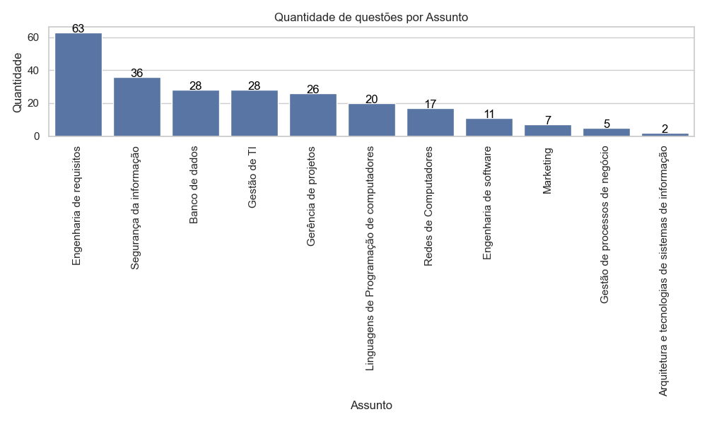

# Projeto: Detecção e Classificação de Questões em Provas

Este projeto automatiza a detecção e classificação de questões em provas, utilizando YOLO para detecção de objetos e scripts personalizados para classificação de questões em tópicos específicos.

---

## Estrutura de Diretórios

Os dados utilizados estão organizados da seguinte forma:

```
data
│
├── prova_dataset           # Contém os PDFs das provas a serem rotuladas.
├── provas_pdf              # Contém os PDFs de provas gerais.
├── imgs
│   ├── imgs_pages          # Imagens geradas de todas as provas.
│   ├── imgs_train          # Imagens extraídas das provas para rotulação.
dataset
│
├── original
│   ├── imagens             # Imagens rotuladas exportadas.
│   ├── labels              # Anotações no formato YOLO.
│   ├── classes.txt         # Arquivo de classes.
│   ├── notes.json          # Informações adicionais de rotulação.
│
├── augmented
│   ├── imagens             # Imagens com data augmentation.
│   ├── labels              # Anotações correspondentes.
│   ├── train               # Conjunto de treinamento.
│   ├── val                 # Conjunto de validação.
model
│
└── yolov11n_best.pt        # Modelo YOLO pré-treinado para análise de documentos.
```

---

## Pré-requisitos

1. **Tesseract OCR**  
   O Tesseract deve estar instalado no servidor ou computador que executará os scripts.  
   [Guia de instalação do Tesseract OCR](https://github.com/tesseract-ocr/tesseract?tab=readme-ov-file#installing-tesseract)  
   Certifique-se de instalar o idioma português.

2. **YOLOv11**  
   Baixe um modelo YOLO pré-treinado.  
   [YOLOv11 para análise de documentos](https://github.com/moured/YOLOv11-Document-Layout-Analysis/?tab=readme-ov-file)

3. **Label Studio**  
   Ferramenta para rotular imagens.  
   [Guia de instalação do Label Studio](https://github.com/heartexlabs/label-studio)

4. **Instalação das Dependências e versão do python**  
   O python deve está na versão 3.10.11  
   Certifique-se de instalar todas as dependências necessárias rodando o comando:  
   ```bash
   pip install -r requirements.txt
   ```

---

## Instruções de Uso
Para realizar todas as etapas dessa instrução apague todos os arquivos contidos nos diretórios(deixe a estrutura de pastas) :

```
data\imgs\imgs_dataset
data\imgs\imgs_pages
dataset\augmented
dataset\augmented\images
dataset\augmented\labels
dataset\augmented\train\images
dataset\augmented\train\labels
dataset\augmented\val\images
dataset\augmented\val\labels
dataset\original
dataset\original\images
dataset\original\labels
runs

```

### 1. Geração de Imagens

Utilize o script `extract_imagen_pixmap.py` para extrair imagens dos PDFs:

**a. Gerar imagens de todos os PDFs**
```python
dir_pdfs = "data/provas_pdf/*.pdf"
out_imgs = "data/imgs/imgs_pages"
```

**b. Gerar imagens de provas específicas para rotulação**
```python
dir_pdfs = "data/prova_dataset/*.pdf"
out_imgs = "data/imgs/imgs_train"
```

---

### 2. Rotulação das Imagens

Rode o Label Studio para rotular as imagens:
```bash
label-studio
```

Exporte no formato YOLO e extraia para `dataset/original`:
```
dataset
│
└───original
    ├── imagens
    ├── labels
    ├── classes.txt
    └── notes.json
```

---

### 3. Aplicar Data Augmentation

Execute o script `updateDataSet_yolo.py` após ajustar as variáveis:
```python
img_dir = 'dataset/original/images'
label_dir = 'dataset/original/labels'
img_dir_out = 'dataset/augmented/images'
label_dir_out = 'dataset/augmented/labels'
```

Uma nova pasta `augmented` será criada.

---

### 4. Divisão em Treinamento e Validação

Rode o script `train_test_yolo.py` para dividir os dados:
```python
dataset_path = 'dataset/augmented/'
```

A estrutura final será:
```
dataset
│
└───augmented
    ├── train
    │   ├── imagens
    │   ├── labels
    └── val
        ├── imagens
        ├── labels
```

---

### 5. Treinamento do Modelo

Baixe um modelo pré-treinado e adicione na pasta `data/model`. Inicie o treinamento com:
```bash
yolo train model=data/model/yolov11n_best.pt data=yolo.yaml
```

---

### 6. Detecção de Questões

Utilize o modelo treinado para detectar questões:
```python
model = YOLO('runs/detect/train6/weights/best.pt') # Modelo treinado
dir_imgs = 'data/imgs/imgs_pages/*.png'           # Imagens das páginas das provas
```

Ao final, será gerado o arquivo `questions.json` contendo os textos das questões detectadas.

---

### 7. Classificação de Questões

Rode o script `questionClassify.py` para classificar as questões nos assuntos desejados:
```python
assuntos = [
    'Gerência de projetos',
    'Segurança da informação',
    'Redes de Computadores',
    'Gestão de TI',
    'Marketing',
    'Engenharia de requisitos',
    'Engenharia de software',
    'Linguagens de Programação de computadores',
    'Arquitetura e tecnologias de sistemas de informação',
    'Gestão de processos de negócio',
    'Banco de dados',
]
```

Um gráfico será gerado mostrando o ranking dos assuntos mais recorrentes.


---

## Conclusão

Este pipeline automatiza desde a detecção até a classificação de questões de provas. 🚀

